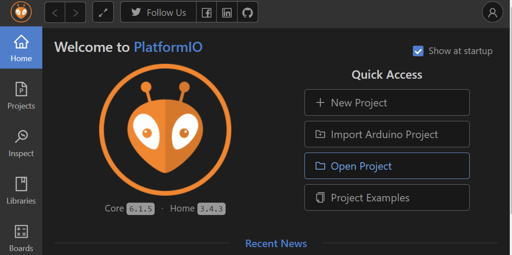
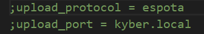
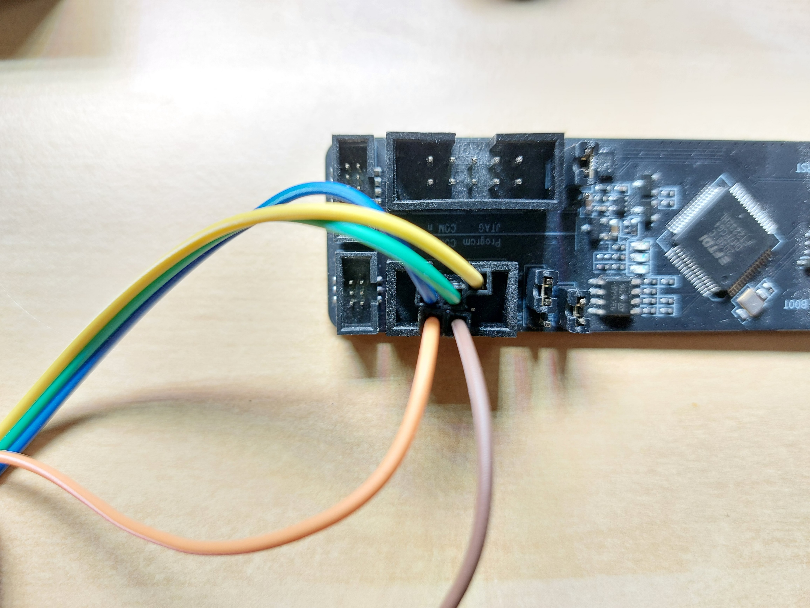
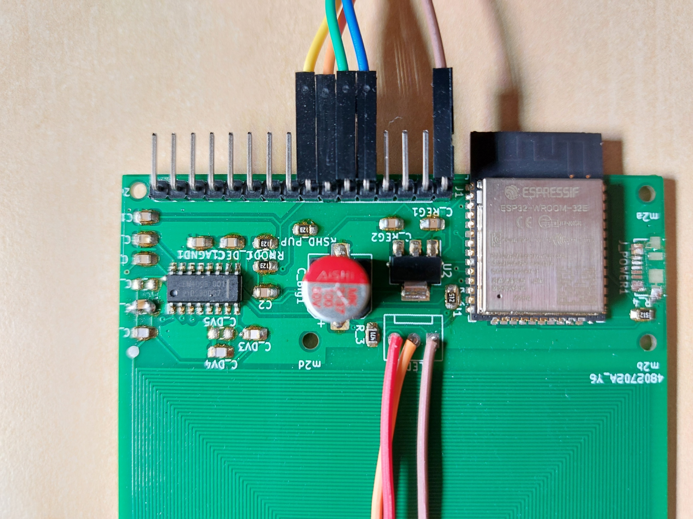

# Using this board
! Many computer usb ports do not provide enough power for this board use an independent usb power supply like a 1+ amp phone charger.

# Setup
This project is platform io based
Open the root folder with platform io
1. Install Platfrom.IO https://platformio.org/install
2. Open the root folder of this repository with Platform.IO open project

3. Run pio build to verify project

# Flashing
### Over the air
1. Connect to the network your esp32 rfid reader is on
   This should be "ESP32 RFID" id your board is still in the default ap mode
2. Ensure your platform.ini file set to due ota
   uncomment these lines 
3. You should now be able to upload new firmware via wifi in vscode platform.io

NOTE if you new code crashes or disables arduino ota ota uploads may longer be possible.

### Serial via esp-prog
To program this board over usb serial a esp-prog is recommend. https://docs.espressif.com/projects/espressif-esp-dev-kits/en/latest/other/esp-prog/user_guide.html

1. Connecting esp-prog
    + Its is recommended to power this board via an external power supply instead of using the esp-prog 5v out. 

    Example: 

2. Selecting a serial port 
    + if you need to specify a port add add `upload_port = <portname>` to platformio.ini

# Board pin out
